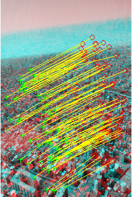
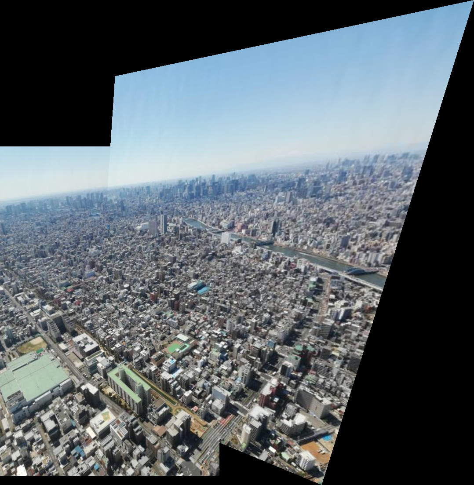

An image panoramic stitching program using FAST (Features from Accelerated Segment Test) and RANSAC (RANdom SAmple Consensus), written in MATLAB. Works with multiple images, at different angles and spaces.

This program first extracts features using a corner detection method known as FAST. In short, FAST works by evaluating a ring with some radius around a pixel, and contrasting several points on the ring to the center pixel. If enough points are over a certain threshold, the center pixel is marked as a corner.

With two sets of images and features, Random Sample Consensus is applied with feature matching to evaluate which group of features (corners) are associated in both images. Then a transform is calculated. 

A panorama is generated with the estimated length of the full image, and all the images are subqeuntly transformed to give a stitched final result.

